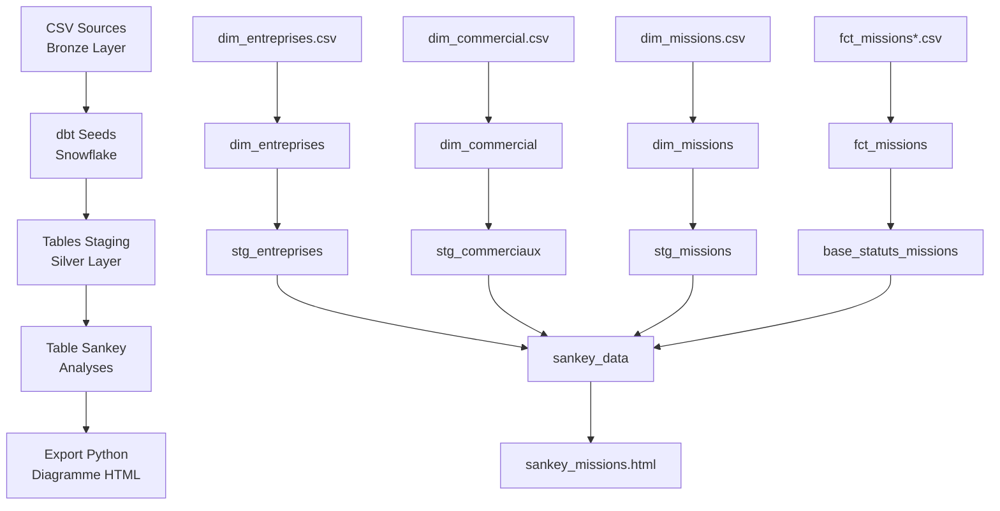

# Rapport TP dbt + Snowflake : Pipeline de Données avec Diagramme de Sankey

> **Clara DUBOST , Sirine DAKHLI**
>
> **Cours** : DataOPS
>
> **Université de Nantes IDIA2026**- 2025

---

## Schéma des Transformations de Données



**Architecture Bronze → Silver → Gold :**

* **Bronze** : Données brutes CSV chargées via `dbt seed`
* **Silver** : Tables nettoyées et typées avec tests de qualité
* **Gold** : Données d'analyse (sankey_data) pour visualisation

---

## Tests de Qualité et Tests Unitaires

### Tests de Qualité Implémentés (21 tests au total)

**Tests d'Unicité (Clés primaires)**

* `id_entreprise` unique dans `stg_entreprises`
* `id_commercial` unique dans `stg_commerciaux`
* `id_mission` unique dans `stg_missions`
* `email_commercial` unique dans `stg_commerciaux`

**Tests de Non-Nullité (Colonnes obligatoires)**

* Tous les identifiants (IDs) obligatoires
* Noms d'entreprises et emails renseignés
* Statuts et dates de statut présents
* Salaires proposés non vides

**Tests de Relations (Clés étrangères)**

* `stg_commerciaux.id_entreprise` → `stg_entreprises.id_entreprise`
* `stg_missions.id_commercial` → `stg_commerciaux.id_commercial`
* `base_statuts_missions.id_mission` → `stg_missions.id_mission`

**Tests de Valeurs Acceptées**

* Tailles d'entreprise : `PME`, `Startup`, `Grande entreprise`
* Statuts : `Nouveau`, `Premier contact`, `Entretien planifié`, etc.

**Tests de Logique Métier**

* Salaires > 0 (avec `dbt_utils.expression_is_true`)

### Test Unitaire Personnalisé

**Problème détecté :** Lors du développement, nous avons créé un test pour vérifier qu'aucune mission dans `base_statuts_missions` ne référence une mission inexistante.

**Première approche (échouée) :**

```sql
select count(*) as nb_lignes_manquantes
from (
    select distinct id_mission from base_statuts_missions
    except
    select id_mission from stg_missions
) as missions_orphelines
```

**Problème identifié :** Le test retournait 1 ligne avec `count(*) = 0`, mais dbt considère tout résultat > 0 lignes comme un échec.

**Solution finale :**

```sql
select distinct id_mission
from base_statuts_missions
except 
select id_mission from stg_missions
```

**Apprentissage clé :** Les tests dbt fonctionnent sur le principe : 0 lignes = PASS, X lignes = FAIL. Le test doit montrer directement les lignes problématiques, pas les compter.

---

## Réalisations Techniques

### Fonctionnalités Développées

**1. Auto-détection des batches**

* Système intelligent utilisant le manifest dbt
* Union automatique de tous les fichiers `fct_missions*`
* Ajout de nouveaux batches sans modification de code

**2. Pipeline d'automatisation complet**

* Script `sankey_auto.py` : dbt run → export → génération Sankey
* Export automatique depuis Snowflake vers CSV
* Génération de diagramme HTML interactif avec métriques


**3. CI/CD GitLab**

* Pipeline en 4 étapes : build → test → docs → visualisation
* Tests automatiques à chaque commit
* Génération de documentation dbt
* Artéfacts téléchargeables (HTML, documentation)

**4. Diagramme de Sankey interactif**

* Interface responsive avec animations CSS
* Métriques automatiques (taux de conversion, recommandations)
* Analyse intelligente des performances du funnel

### Innovation : Variables pour Optimisation des Tests

**Problème :** Tests lents sur gros volumes de données

**Solution :** Possibilité de tester seulement les données récentes

```bash
dbt test --vars '{"test_date": "2024-03-01"}'  # Teste seulement mars
```

---

## Difficultés Rencontrées

### 1. GitLab CI/CD - Gestion des Dépendances

**Problème :** Packages dbt non disponibles entre les étapes du pipeline

**Solution :** Ajout de `dbt deps` dans `before_script` pour installation globale

### 2. Tests dbt - Découverte des Vraies Valeurs

**Découverte :** Les valeurs réelles diffèrent de nos hypothèses initiales

* **Statuts attendus :** `Contacté`, `Devis envoyé`
* **Statuts réels :** `Premier contact`, `Proposition envoyée`

**Apprentissage :** Importance de l'exploration des données avant définition des tests

### 4. Gestion des Batches

**Innovation implémentée :** Système d'auto-détection des batches via le manifest dbt

**Fonctionnement :**

1. `dbt seed --select fct_missions_batch2` → Charge le nouveau batch
2. `dbt run --select base_statuts_missions` → **Détecte et combine automatiquement** tous les fichiers `fct_missions*`

**Avantage :** Ajout de nouveaux batches sans modification de code SQL !

**Conclusion :** Système pas entièrement automatique, amélioration possible avec matérialisation incrémentale.

---

## Retour sur le Cours

### Points Très Positifs

**Interface Snowflake :** Excellente découverte ! Nous ne connaissions pas Snowflake et l'interface graphique est beaucoup plus visuelle que ce que nous imaginons. C'est très intuitif.

**Concept de Pipelines Data :** Nous pensions que les pipelines n'existaient que dans Docker. Découvrir qu'on peut faire des pipelines dans le domaine data est très utile !

**Application Professionnelle :** Nous avons choisi le projet 6 (visualisation), puisque nous faisons de la datavizualisation au travail avec des tableaux de bord. Pouvoir appliquer ce que nous avons appris ici est génial !

**Diagrammes de Sankey :** Nous ne connaissions pas du tout, mais c'est super utile pour visualiser les flux et transitions !

**Pédagogie :** Le cours est vraiment super bien et intéressant. C'est génial d'avoir le choix des projets, être guidés sans que ce soit trop restrictif. On peut tout explorer !

### Apprentissages Clés

* **dbt** : Découverte complète de l'outil, des tests, de la documentation
* **Snowflake** : Première utilisation, interface très appréciée
* **CI/CD pour la data** : Concept nouveau et puissant
* **Tests de qualité** : Importance cruciale dans les pipelines data
* **Visualisation de flux** : Sankey pour analyser les parcours

### Suggestions d'Amélioration

**Aucune suggestion négative !** Le format est parfait avec :

* Liberté de choix du projet
* Documentation claire
* Accompagnement équilibré
* Technologies modernes et pertinentes

---

## Temps Passé

**Estimation totale : 18-20 heures**

**Répartition :**

* **Configuration initiale** (dbt, Snowflake, environnement) : 1h30
* **Développement des modèles dbt** : 1h30
* **Tests de qualité et debugging** : 4h
* **Scripts Python d'automatisation** : 4h
* **GitLab CI/CD et problèmes d'encodage** : 3h
* **Diagramme de Sankey et finition** : 3h
* **Documentation et rapport** : 1h

---

## Diagramme de Sankey Généré


*Le diagramme interactif montre le parcours des 15 missions à travers les différents statuts, avec métriques automatiques et analyses de performance.*

**Métriques clés obtenues :**

* **15 missions** analysées au total
* **Taux de conversion :** 53% (8 acceptées)
* **2 missions en cours** nécessitant un suivi
* **Identification automatique** des goulots d'étranglement

---

## Conclusion

Ce TP a été une excellente découverte des technologies modernes de la data. L'approche pratique avec un cas d'usage concret (funnel freelance) rend l'apprentissage très engageant. La liberté de choisir notre projet et d'explorer nous a permis une appropriation personnelle des concepts.


**Objectif atteint :** Pipeline complet fonctionnel de A à Z avec automatisation, tests, CI/CD et visualisation interactive !
