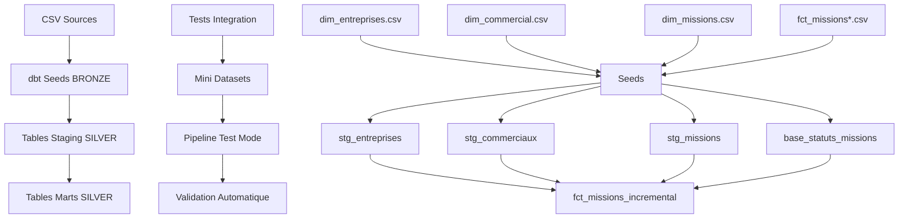

# Rapport TP dbt + Snowflake : Tests de Bout en Bout

> **Clara DUBOST**  
> **Cours** : DataOPS  
> **Université de Nantes IDIA2026** - 2025

---

## 🎯 Objectif du TP et Choix Réalisé

Ce TP proposait de créer un pipeline de données avec dbt et Snowflake pour analyser le funnel de missions d'un freelance. Le TP offrait un choix entre **deux approches** pour la partie finale :

- **Partie 6** : Visualisation (diagramme de Sankey)
- **Partie 7** : Tests de bout en bout (approche ops)

**J'ai choisi la partie 7** car elle correspond davantage à mon profil ingénieur et à mes préoccupations de qualité et de robustesse des pipelines de données.

---

## 🏗️ Architecture du Pipeline Réalisé



**Architecture en 3 couches :**
- **BRONZE** : Données brutes CSV via `dbt seed`
- **SILVER** : Tables nettoyées et typées avec tests de qualité
- **MARTS** : Tables analytiques finales avec matérialisation incrémentale

---

## 🧪 Tests de Qualité Implémentés

### Tests dbt Standard (21 tests)

**Tests d'intégrité des données :**
- ✅ **Unicité** : Clés primaires (`id_entreprise`, `id_commercial`, `id_mission`, `email_commercial`)
- ✅ **Non-nullité** : Colonnes obligatoires (identifiants, noms, statuts)
- ✅ **Relations** : Clés étrangères entre tables
- ✅ **Valeurs acceptées** : Énumérations (tailles d'entreprise, statuts de mission)
- ✅ **Logique métier** : Salaires > 0

**Auto-détection des batches :**
Union automatique de tous les fichiers `fct_missions*` détectés dans le projet, permettant l'ajout de nouveaux batches sans modification de code.

---

## 🎯 Innovation Principale : Tests de Bout en Bout (Partie 7)

### Problématique Identifiée

Comment s'assurer que les transformations dbt produisent **exactement** les résultats attendus sur l'ensemble du pipeline ?

### Solution Développée

**1. Système de Mini Datasets**

Création de données de test simplifiées :
```
seeds/integration_tests/
├── input/                    # 2-5 lignes par table
│   ├── test_dim_entreprises.csv
│   ├── test_dim_commercial.csv
│   ├── test_dim_missions.csv
│   └── test_fct_missions.csv
└── expected/                 # Résultats attendus calculés manuellement
    ├── expected_stg_entreprises.csv
    ├── expected_stg_commerciaux.csv
    ├── expected_stg_missions.csv
    └── expected_base_statuts_missions.csv
```

**2. Macro de Basculement Prod/Test**

```sql

  
    
      {{ return(ref('test_dim_entreprises')) }}
    
  
    {{ return(ref(model_name)) }}
  

```

**Utilisation :**
- **Mode production** : `dbt run` → Tables complètes (100+ lignes)
- **Mode test** : `dbt run --vars '{"integration_test_mode": true}'` → Mini datasets (2-5 lignes)

**3. Tests de Validation Automatique**

Macro `test_integration_pipeline()` qui compare automatiquement chaque table transformée avec son résultat attendu via des requêtes `EXCEPT`.

### Résultats Obtenus

```
🧪 TESTS D'INTÉGRATION - PIPELINE COMPLET
==================================================
📊 Test de stg_entreprises...
✅ SUCCÈS: stg_entreprises correspond parfaitement !
📊 Test de stg_commerciaux...
✅ SUCCÈS: stg_commerciaux correspond parfaitement !
📊 Test de stg_missions...
✅ SUCCÈS: stg_missions correspond parfaitement !
📊 Test de base_statuts_missions...
✅ SUCCÈS: base_statuts_missions correspond parfaitement !

🎉 RÉSULTAT : 4/4 tables validées avec succès !
```

---

## 🔧 Pipeline CI/CD GitLab

Pipeline automatisé en 4 étapes :

1. **Build** : `dbt seed` + `dbt run`
2. **Test** : `dbt test` (tests de qualité)
3. **Docs** : `dbt docs generate`
4. **Integration Tests** : Validation bout en bout automatique

**Innovation :** Intégration des tests de bout en bout dans le pipeline CI/CD pour validation automatique à chaque commit.

---

## ⚠️ Principales Difficultés Rencontrées

### 1. Limitations Snowflake vs dbt

**Problème :** `SELECT * EXCEPT(loaded_at)` non supporté par Snowflake  
**Solution :** Lister explicitement toutes les colonnes dans les comparaisons

### 2. Conflit avec les Macros dbt Built-in

**Problème :** Impossible de redéfinir la macro `ref()` native de dbt  
**Solution :** Création de `custom_ref()` et modification de tous les modèles

### 3. GitLab CI/CD - Syntaxe YAML

**Problème :** Échec des commandes avec variables JSON  
**Solution :** Utilisation du format multi-lignes `|` pour les commandes complexes

### 4. Gestion des Timestamps

**Problème :** `loaded_at` généré par `current_timestamp()` toujours différent  
**Solution :** Exclusion systématique de cette colonne des comparaisons de tests

---

## 📚 Retour sur le Cours

### Points Très Positifs

**🎯 Technologies Modernes :** Découverte de dbt et Snowflake, très utilisés en entreprise  
**🔄 Approche Pipeline :** Vision complète des pipelines de données modernes  
**🧪 Culture Qualité :** Importance des tests dans les projets data  
**🎓 Pédagogie :** Liberté de choix (partie 6 vs 7), accompagnement équilibré

### Apprentissages Concrets

- **dbt** : Modèles, tests, macros, variables, matérialisations
- **Snowflake** : Interface moderne et intuitive pour un data warehouse cloud
- **Tests d'intégration** : Validation automatique des transformations
- **CI/CD pour la data** : Pipeline DevOps appliqué aux données

### Applicabilité Professionnelle

Les concepts appris sont directement transférables dans mon alternance au Ministère des Affaires Étrangères pour améliorer la qualité et la robustesse de nos pipelines de données.

---

## ⏱️ Estimation du Temps Passé

**Total : ~20 heures**

**Répartition :**
- Configuration initiale (dbt, Snowflake) : 2h
- Développement modèles et tests de base : 3h
- **Tests d'intégration (partie 7)** : 10h
  - Création mini datasets : 1h
  - Développement macro `custom_ref` : 3h
  - Résolution problèmes Snowflake : 4h
  - Tests et validation : 2h
- GitLab CI/CD : 3h
- Documentation : 2h

---

## 🎯 Conclusion

**Objectif atteint :** Création d'un système complet de tests de bout en bout pour pipelines dbt, validant automatiquement que les transformations produisent les résultats attendus.

**Innovation technique :** Système de basculement prod/test avec mini datasets, permettant des tests rapides et fiables des transformations complexes.

**Valeur ajoutée :** Solution directement applicable en environnement professionnel pour assurer la qualité des pipelines de données et éviter les régressions.

**Résultat :** 4/4 tests d'intégration validés avec succès, pipeline CI/CD fonctionnel avec validation automatique.